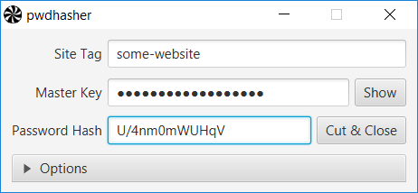

# pwdhasher  

This application is a simple password generator. It generates different passwords for different web sites from only one master password. 

pwdhasher is a JavaFX desktop application with only one "page" containing three text fields and some options that control the password generation process. Two of the text fields are for entering a site tag and the master password. The password generator takes these two strings and generates a password hash according to the given options. The password hash is being displayed in the third text field from which it can be copied and used for logging in...

 

## Acknowledgement
The idea originates from the Mozilla plugin [Password Hasher](https://addons.mozilla.org/de/firefox/addon/password-hasher/), which is unfortunately not supported in current Firefoxes. 

Another implementation has been made for the Android platform by Thilo-Alexander Ginkel. The source code for that Android app can be found here: [Hash It!](https://github.com/ginkel/hashit). From this implementation the class [com.ginkel.hashit.PasswordHasher](https://github.com/ginkel/hashit/blob/master/src/main/java/com/ginkel/hashit/PasswordHasher.java) has been reused here, although some minor changes have been made, e.g. regarding the Android logging and Base64 related stuff.

The application window icon has been copied from the Gemicon Icon Set: "A handcrafted icon set by Turqois (http://turqois.com), which there 3 different sizes (16, 32, 64). Each icon created with pixel-perfect shape layer on Photoshop. Released for Smashing Magazine and design community (http://gemicon.net)."

## Usage
This project uses Maven to build. So, after you would have cloned this repository, an easy 

    mvn package

should be sufficient to generate an executable jar file:

    java -jar <the-generated-jar-file>
